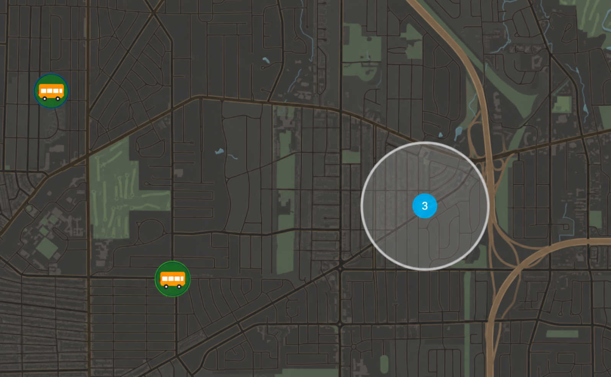

# FirstView Home Assistant Integration (HACS)

Custom Home Assistant integration for FirstView monitoring.



## Features

- Config flow asks for:
  - Email
  - Password
  - Preset (`custom` or `school_default`)
  - AM enabled checkbox
  - Morning websocket window start/end
  - PM enabled checkbox
  - Afternoon websocket window start/end
  - Daily refresh interval (hours)
  - Frequent refresh interval (minutes)
  - Weekday checkboxes (`M T W R F Sat Sun`; `R` = Thursday)
- Window validation enforces max 4 hours per window.
- Automatic monitoring:
  - Daily checks: students + trips
  - Hourly checks: trips progress, notifications, recent location
- Websocket:
  - Connects only during configured AM/PM windows and enabled weekdays
  - Auto-retries with backoff
  - Re-subscribes with trip IDs + vehicle IDs
  - Reuses last successful subscriptions during startup before first poll
  - Jittered reconnect backoff with diagnostics
  - Fires HA event `firstview_live_event` for automations
- Entities:
  - Sensors for counts + websocket status
  - Device trackers per student bus and per vehicle (Map markers use a school-bus `entity_picture`; list UI uses `mdi:bus-school`)
  - Options to show/hide student trackers and/or vehicle trackers on the Map (disabled entities are removed from `/map`)
  - Bus telemetry attributes on tracker (vehicle ID, device ID, heading, speed, odometer, ignition/motion/door)
  - Supports options flow to update AM/PM windows without re-adding integration
  - Device-page button: **Toggle Websocket** (manual on/off override; still constrained by enabled days/windows and 4-hour window settings)
  - Action entities:
    - Mark all notifications read
    - Select notification ID + status (`READ`/`CREATED`) and apply
    - Delete selected notification (double-press confirm)
    - Delete all notifications (double-press confirm)

## Runtime stability behavior

- Cognito refresh/login uses retry + exponential backoff with jitter.
- On transient auth/network/API errors, coordinator serves last-good cached data to reduce unavailable flapping.
- Repeated auth failures create a persistent Home Assistant notification; it is cleared automatically after successful recovery.

## Installation

1. Copy `custom_components/firstview` into your Home Assistant `custom_components/`.
2. Restart Home Assistant.
3. Add integration from **Settings -> Devices & Services -> Add Integration**.
4. Search for `FirstView`.

## Example: bus near-home notifications

Alert on **buses/routes**, not student trackers. If two kids share a bus, per-student alerts would double-notify.

| Route (example) | Notes |
|-----------------|--------|
| `RT-12` | One bus device; vehicle ID on the tracker changes day to day |
| `RT-15` | Duplicate the automation below and swap the route string |

Supporting pieces:

- Passive zone `zone.bus_alert` at home, radius **610 m (~2000 ft)**, icon `mdi:bus-school` (passive so it does not affect person home/away)
- Automations match FirstView `device_tracker` entities by the `route` attribute, so changing `vehicleId`s still work
- 20-second debounce; optional gate on a vacation helper
- Notify via your phone notify entities (`notify.send_message`)

Example automation for route **RT-12** (copy and change `RT-12` → your other route code for each bus):

```yaml
alias: "FirstView: RT-12 bus near home"
id: firstview_bus_rt12_near_home
description: >
  Notify when FirstView route RT-12 bus is within 2000 ft of home.
  Matches by route so vehicle ID changes still work; one alert per bus (not per kid).
mode: single
max_exceeded: silent
triggers:
  - trigger: template
    id: near
    for:
      seconds: 20
    value_template: >
      
      
      
        
        
          
        
      
      {{ ns.near }}
conditions:
  - condition: state
    entity_id: input_boolean.vacation_mode
    state: "off"
actions:
  - action: notify.send_message
    target:
      entity_id:
        - notify.your_phone
    data:
      title: "School bus nearby (RT-12)"
      message: >
        
        
        
          
          
            
            
            
          
        
        {{ ns.name }} ({{ ns.students }}) is within 2000 ft of home.
```

Suggested websocket windows when several routes are staggered (max 4 hours each): e.g. AM `06:00`–`10:00`, PM `13:00`–`17:00`.

## Notes

- Uses Cognito SRP login via `pycognito`.
